# 📊 Obsidian AI Chat System - Complete Project Flowchart

**Document Version:** 1.0  
**Last Updated:** May 6, 2026  
**Status:** In Development

---

## 🎯 System Overview Flowchart

```mermaid
graph TD
    Start["🎯 START PROJECT"] 
    
    %% Setup Phase
    Start --> Setup["⚙️ SETUP PHASE"]
    Setup --> Install["📥 Install Ollama<br/>ollama serve"]
    Install --> Model["🤖 Download AI Model<br/>mistral/llama2/etc"]
    Model --> Backend["🚀 Start Backend Server<br/>npm install"]
    Backend --> Frontend["🌐 Open Browser<br/>http://127.0.0.1:3001"]
    
    %% Frontend Load
    Frontend --> UILoad["💻 Frontend UI Loads"]
    UILoad --> FileBrowser["📁 File Browser<br/>Display Obsidian Vault"]
    UILoad --> ChatUI["💬 Chat Interface<br/>Display Input & History"]
    
    %% File Selection Flow
    FileBrowser -->|User Selects File| FileSelect["📄 File Selected"]
    FileSelect --> FileAPI["🔙 Backend API<br/>GET /file"]
    FileAPI --> ReadFile["📖 Read File Content<br/>from Vault"]
    ReadFile --> CacheFile["💾 Cache File Content<br/>in Memory"]
    CacheFile --> DisplayFile["✅ Display in Sidebar<br/>with Highlighting"]
    
    %% Chat Input
    ChatUI -->|User Types Message| Input["✍️ User Input"]
    Input --> Validate["✔️ Validate Message<br/>Length & Format"]
    Validate --> CheckFile{File Context<br/>Selected?}
    
    %% File Context Path
    CheckFile -->|Yes| BuildContext["📦 Build Context<br/>Message + File Content"]
    CheckFile -->|No| BuildContext2["📦 Build Context<br/>Message Only"]
    BuildContext --> PrepMsg["🔤 Prepare Message<br/>for AI"]
    BuildContext2 --> PrepMsg
    
    %% NEW: Analyze Intent for SOP
    PrepMsg --> AnalyzeIntent["🧠 Analyze User Intent<br/>Keywords & Context"]
    AnalyzeIntent --> SOPDetect{Detect Relevant<br/>SOPs?}
    
    %% SOP Pull-Back Request (IN PROGRESS)
    SOPDetect -->|Yes| FetchSOP["🔄 PULL-BACK REQUEST<br/>(Live Fetching - IN PROGRESS)<br/>Search SOP Folder"]
    SOPDetect -->|No| DirectAI["→ Skip SOP Matching"]
    
    FetchSOP --> SOPMatch["🎯 Match Relevant SOPs<br/>AI Generated Audit SOP<br/>Batch Assignment SOP<br/>Download Batches SOP<br/>etc."]
    SOPMatch --> FetchContent["📥 Live Fetch SOP Content<br/>from Obsidian/database"]
    FetchContent --> InjectSOP["💉 Inject SOP Logic<br/>into System Prompt"]
    InjectSOP --> SendAI
    DirectAI --> SendAI["📤 Send to Ollama API<br/>127.0.0.1:11434"]
    
    %% Ollama Processing (IN PROGRESS)
    SendAI --> OllamaCheck["🔌 OLLAMA INTEGRATION<br/>(Enhancing - IN PROGRESS)<br/>Connection Pool Check"]
    OllamaCheck --> HealthCheck["💚 Model Health Check<br/>Verify Model Ready"]
    HealthCheck --> HealthOK{Model<br/>Healthy?}
    
    HealthOK -->|No| Fallback["⚠️ Use Fallback Model<br/>or Queue Request"]
    HealthOK -->|Yes| Process["⚙️ Process with AI Model<br/>Apply SOP Logic"]
    Fallback --> Process
    
    Process --> Generate["🧠 Generate Response<br/>with SOP Context"]
    Generate --> Response["💭 AI Response Ready<br/>Following SOP Procedures"]
    
    %% Response Processing
    Response --> ParseResp["📝 Parse Response<br/>Extract Content"]
    ParseResp --> Format["✨ Apply Markdown<br/>& Syntax Highlighting"]
    Format --> Display["💬 Display in Chat<br/>Real-time Streaming"]
    
    %% Save & Organize (IN PROGRESS)
    Display --> Save["💾 ORGANIZE CHAT HISTORY<br/>(Sorting - IN PROGRESS)"]
    
    Save --> OrgCheck{Organize By:}
    OrgCheck -->|Date| DateOrg["📅 Save to<br/>Vault/Chats/2026-05-06/"]
    OrgCheck -->|Topic| TopicOrg["🏷️ Detect Topic<br/>& Create Folder"]
    OrgCheck -->|SOP| SOPOrg["📋 Link to Associated<br/>SOP Folder"]
    
    DateOrg --> CreateFile["📄 Create Chat File<br/>with Metadata"]
    TopicOrg --> CreateFile
    SOPOrg --> CreateFile
    
    CreateFile --> FinalSave["✅ Save to:<br/>Vault/Chats/[DATE]/[TOPIC]/[SOP]<br/>chat-timestamp.md"]
    
    %% History Display
    FinalSave --> HistoryView["📊 Update Chat History View<br/>with New Chat"]
    HistoryView --> ShowOrg["🎯 Display Organized History:<br/>Date Sorting<br/>Topic Grouping<br/>SOP Association"]
    
    %% Follow-up Loop
    ShowOrg -->|User Asks Follow-up| Input
    ShowOrg -->|User Selects Different File| FileSelect
    ShowOrg -->|User Searches History| Search["🔍 Search Chat History<br/>by Date/Topic/SOP"]
    Search --> Filter["🎯 Filter Results<br/>by Criteria"]
    Filter --> DisplayResults["📋 Show Matching Chats"]
    DisplayResults -->|Open Chat| Input
    
    ShowOrg -->|Exit| End["🏁 End Session"]
    
    %% Styling
    style Start fill:#4CAF50,color:#fff,stroke:#2E7D32,stroke-width:3px
    style Setup fill:#2196F3,color:#fff
    style Install fill:#2196F3,color:#fff
    style Model fill:#2196F3,color:#fff
    style Backend fill:#2196F3,color:#fff
    style Frontend fill:#2196F3,color:#fff
    
    style UILoad fill:#9C27B0,color:#fff
    style FileBrowser fill:#9C27B0,color:#fff
    style ChatUI fill:#9C27B0,color:#fff
    
    style FileSelect fill:#FF9800,color:#fff
    style FileAPI fill:#FF9800,color:#fff
    style ReadFile fill:#FF9800,color:#fff
    style CacheFile fill:#FF9800,color:#fff
    style DisplayFile fill:#4CAF50,color:#fff
    
    style Input fill:#9C27B0,color:#fff
    style Validate fill:#9C27B0,color:#fff
    style CheckFile fill:#FF5722,color:#fff
    style BuildContext fill:#FF5722,color:#fff
    style BuildContext2 fill:#FF5722,color:#fff
    style PrepMsg fill:#FF5722,color:#fff
    
    style AnalyzeIntent fill:#E91E63,color:#fff,stroke:#C2185B,stroke-width:2px
    style SOPDetect fill:#E91E63,color:#fff,stroke:#C2185B,stroke-width:2px
    style FetchSOP fill:#FF6F00,color:#fff,stroke:#E65100,stroke-width:3px
    style SOPMatch fill:#FF6F00,color:#fff,stroke:#E65100,stroke-width:2px
    style FetchContent fill:#FF6F00,color:#fff,stroke:#E65100,stroke-width:2px
    style InjectSOP fill:#FF6F00,color:#fff,stroke:#E65100,stroke-width:2px
    style DirectAI fill:#E91E63,color:#fff
    
    style SendAI fill:#FF5722,color:#fff
    style OllamaCheck fill:#F57C00,color:#fff,stroke:#E65100,stroke-width:3px
    style HealthCheck fill:#F57C00,color:#fff,stroke:#E65100,stroke-width:2px
    style HealthOK fill:#F57C00,color:#fff,stroke:#E65100,stroke-width:2px
    style Fallback fill:#FF9800,color:#fff
    style Process fill:#FF5722,color:#fff
    style Generate fill:#FF5722,color:#fff
    style Response fill:#4CAF50,color:#fff
    
    style ParseResp fill:#9C27B0,color:#fff
    style Format fill:#9C27B0,color:#fff
    style Display fill:#4CAF50,color:#fff
    
    style Save fill:#00BCD4,color:#fff,stroke:#0097A7,stroke-width:3px
    style OrgCheck fill:#00BCD4,color:#fff,stroke:#0097A7,stroke-width:2px
    style DateOrg fill:#00BCD4,color:#fff,stroke:#0097A7,stroke-width:2px
    style TopicOrg fill:#00BCD4,color:#fff,stroke:#0097A7,stroke-width:2px
    style SOPOrg fill:#00BCD4,color:#fff,stroke:#0097A7,stroke-width:2px
    style CreateFile fill:#00BCD4,color:#fff,stroke:#0097A7,stroke-width:2px
    style FinalSave fill:#4CAF50,color:#fff
    
    style HistoryView fill:#00BCD4,color:#fff
    style ShowOrg fill:#4CAF50,color:#fff
    
    style Search fill:#9C27B0,color:#fff
    style Filter fill:#9C27B0,color:#fff
    style DisplayResults fill:#9C27B0,color:#fff
    
    style End fill:#4CAF50,color:#fff,stroke:#2E7D32,stroke-width:3px
```



---

## 🎨 Color Legend

| Color | Section | Status | Details |
|-------|---------|--------|---------|
| 🔵 **Blue** | Setup & Installation | ✅ Completed | Install Ollama, download models, start server |
| 🟣 **Purple** | Frontend UI & Input | ✅ Completed | User interactions, file browser, chat interface |
| 🟠 **Orange** | File Operations | ✅ Completed | File selection, reading, caching, display |
| 🔴 **Red** | Chat Processing | ✅ Completed | Message validation, context building |
| 🩷 **Pink** | Intent Analysis | 🚧 In Progress | Analyze user intent for SOP matching |
| 🟠 **Dark Orange** | **SOP Pull-Back** | 🚧 **IN PROGRESS** | Live fetch & match SOPs from database |
| 🟠 **Burnt Orange** | **Ollama Integration** | 🚧 **IN PROGRESS** | Connection pooling, health checks |
| 🔷 **Cyan** | **Chat History Organization** | 🚧 **IN PROGRESS** | Date sorting, topic grouping, SOP linking |
| 🟢 **Green** | Final Output & Storage | ✅ Completed | Display, saving, session management |

---

## 📍 Main Flow Sections

### **1. SETUP PHASE** (Top Block - Blue)
User initiates the system setup:
```
Install Ollama 
    ↓
Download AI Model (mistral/llama2)
    ↓
Start Backend Server
    ↓
Open in Browser
```

---

### **2. FRONTEND INITIALIZATION** (Left Block - Purple)
UI loads with two main panels:
```
Frontend UI Loads
    ├─→ File Browser (Obsidian Vault)
    └─→ Chat Interface (Input & History)
```

---

### **3. FILE SELECTION PATH** (Left Side - Orange)
When user selects a file:
```
File Selected
    ↓
Backend API (GET /file)
    ↓
Read from Vault
    ↓
Cache Content
    ↓
Display in Sidebar
```

---

### **4. USER INPUT & PREPARATION** (Center - Purple to Red)
When user types a message:
```
User Input
    ↓
Validate Message
    ↓
Check File Context
    ├─→ With File → Build Context (Message + File)
    └─→ No File → Build Context (Message Only)
    ↓
Prepare for AI
```

---

### **5. 🚧 INTENT ANALYSIS & SOP PULL-BACK** (Right Side - Pink & Dark Orange)
**STATUS: IN PROGRESS** - Smart SOP detection and fetching:
```
Analyze User Intent
    ↓
Detect Relevant SOPs?
    ├─→ YES: Pull-Back Request
    │        ├─ Search SOP Folder
    │        ├─ Match Relevant SOPs
    │        ├─ Live Fetch Content
    │        └─ Inject into Prompt
    │
    └─→ NO: Skip SOP Matching
```

**Relevant SOPs to detect:**
- AI Generated Audit SOP
- Batch Assignment SOP
- Download Batches SOP
- Discard Batches SOP
- And others...

---

### **6. 🚧 OLLAMA INTEGRATION** (Right Side - Burnt Orange)
**STATUS: IN PROGRESS** - Enhanced AI processing:
```
Send to Ollama API
    ↓
Connection Pool Check
    ↓
Model Health Check
    ↓
Model Healthy?
    ├─→ YES: Process with AI
    └─→ NO: Use Fallback Model
    ↓
Generate Response (with SOP Logic)
```

**Enhancements in progress:**
- Connection pooling
- Model health monitoring
- Fallback mechanisms
- Better error handling

---

### **7. RESPONSE PROCESSING** (Right to Center - Purple & Green)
Format and display the response:
```
Parse Response
    ↓
Apply Markdown & Syntax Highlighting
    ↓
Display in Chat (Real-time)
```

---

### **8. 🚧 CHAT HISTORY ORGANIZATION** (Bottom - Cyan)
**STATUS: IN PROGRESS** - Smart organization system:
```
Auto-Organize Chat
    ├─→ Date-Based
    │   └─ Vault/Chats/2026-05-06/
    │
    ├─→ Topic-Based
    │   └─ Create Topic Folder
    │
    └─→ SOP-Based
        └─ Link to SOP Folder
    ↓
Create File with Metadata
    ↓
Save to: Vault/Chats/[DATE]/[TOPIC]/[SOP]/chat-timestamp.md
    ↓
Update History View
```

**Proposed Structure:**
```
Vault/Chats/
├── 2026-05-06/
│   ├── Batch Management/
│   │   ├── SOP_Batch_Assignment/
│   │   │   └── chat-1630854000000.md
│   │   └── SOP_Download_Batches/
│   │       └── chat-1630854120000.md
│   └── Auditing/
│       └── SOP_AI_Generated_Audit/
│           └── chat-1630854240000.md
└── 2026-05-05/
    └── ...
```

---

### **9. FOLLOW-UP & SEARCH** (Bottom Loop - Purple)
After response, user can:
```
Ask Follow-up Question
    ↓ (returns to User Input)

Select Different File
    ↓ (returns to File Selection)

Search Chat History
    ↓
Filter by Date/Topic/SOP
    ↓
Display Matching Chats
    ↓
Open Chat (returns to User Input)

Exit Session
    ↓ (End)
```

---

## 🚀 In-Progress Features Detail

### **Feature 1: Ollama Integration Enhancement**
**Current Status:** 🚧 In Progress

**What's Being Built:**
- Connection pooling for better performance
- Model health checks before processing
- Fallback model switching
- Better timeout handling
- Improved error recovery

**Location in Flowchart:** Burnt Orange section (right side)

**Expected Impact:**
- Faster response times
- More reliable AI processing
- Better error messages
- Automatic recovery from failures

---

### **Feature 2: Chat History Organization**
**Current Status:** 🚧 In Progress

**What's Being Built:**
- Automatic organization by date (YYYY-MM-DD)
- Topic detection and categorization
- SOP-based grouping
- Search and filter functionality
- Tag system for easy retrieval
- Archive/pin features

**Location in Flowchart:** Cyan section (bottom)

**Expected Impact:**
- Easy chat retrieval
- Better organization
- Quick topic lookup
- Historical tracking
- SOP compliance documentation

---

### **Feature 3: Pull-Back Request & SOP Logic Integration**
**Current Status:** 🚧 In Progress

**What's Being Built:**
- Live SOP fetching based on user intent
- Intelligent SOP matching algorithm
- Context-aware SOP selection
- SOP injection into AI prompts
- SOP compliance verification

**Location in Flowchart:** Dark Orange section (right side)

**Supported SOPs:**
- AI Generated A+ Content Audit SOP
- Batch Assignment SOP
- Download Multiple Batches SOP
- Discard Multiple Batches SOP
- General A+ Content Annotation SOP
- Parameter-level Annotation SOP

**Expected Impact:**
- AI answers follow established procedures
- Automatic relevant documentation lookup
- Consistency with company standards
- Better audit trails

---

## 📊 Data Flow Summary

```
User Input
    ↓
    [File Context] ←──────── File Selection
    ↓
Intent Analysis → SOP Detection
    ↓
[SOP Content] ←──────────── Live Fetch from Vault/Obsidian
    ↓
Build Prompt with SOP Logic
    ↓
Send to Ollama [Health Check]
    ↓
AI Model Processing
    ↓
Response Generation
    ↓
Format & Display
    ↓
Auto-Organize & Save
    ↓
[Chat Storage] ──→ Vault/Chats/[DATE]/[TOPIC]/[SOP]/
```

---

## 📁 File Organization

```
Chat UI/
├── PROJECT_FLOWCHART.md          ← This File
├── START_HERE.md
├── QUICK_REFERENCE.md
├── README.md
├── SETUP_GUIDE.md
├── BACKEND_GUIDE.md
├── FRONTEND_GUIDE.md
├── COMPLETION_SUMMARY.md
├── config.json
├── START.bat
│
└── obsidian-chat/
    ├── backend/
    │   ├── server.js             (Ollama Integration, SOP Logic)
    │   └── package.json
    ├── frontend/
    │   └── index.html            (Chat History Organization UI)
    └── Vault/
        ├── Chats/               (Future: Organized by Date/Topic/SOP)
        └── Obsidian/
            └── database/        (SOP Source Documents)
```

---

## 🔄 Key Integration Points

1. **Backend (server.js)**
   - Ollama connection & health checks
   - SOP fetching logic
   - Intent analysis
   - Response formatting

2. **Frontend (index.html)**
   - Chat history display with filtering
   - File browser integration
   - SOP matching indicators
   - Organized chat history view

3. **Vault Storage**
   - SOP documents in `Obsidian/database/`
   - Chat saves in `Vault/Chats/[organized]`
   - Auto-sorting and tagging

---

## 📝 Notes for Development

- **In-Progress Features** are marked with 🚧 and shown in bold orange/cyan colors
- The flowchart shows the ideal end-state with all features integrated
- Some features are still being developed but architecture is planned
- Fallback mechanisms ensure system works even if some features aren't ready

---

## 🔍 How to Use This Document

1. **Overview:** Read the color legend and main flow sections
2. **Feature Details:** Check the "In-Progress Features Detail" section
3. **Architecture:** Review the data flow summary and integration points
4. **Development:** Use the file organization section to navigate the codebase

---

**Last Updated:** May 6, 2026  
**Version:** 1.0  
**Status:** In Development - All Core Systems Functional, 3 Features Under Active Development
